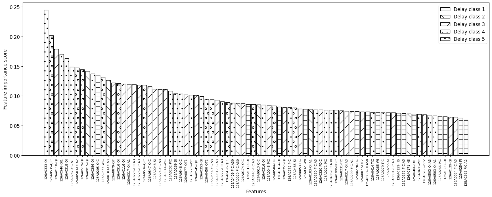

# Metsa Group Project

## Bleach ratio prediction

### Requirements

1. Access to the data
2. Python 3.8
3. Azure inference cluster by default has tensorflow 2.5.0, models trained in tf 2.6.0 cannot be loaded in keras due to some compatibility issue, keep that in mind
4. Looks like requests 2.26 has bug with json (probably, allow_nan set as False), therefore requests 2.25.1 should be used for the endpoint testing

### Installation

1. Clone this repository
2. Create directory ```raw``` in directory ```data```
3. Export bleach ratio data files from Azure in csv format and put them into ```data/raw```
4. pip3 install -r requirements

### Train and deploy prediction models

1. Create datasets:

```bash
python3 create_datasets.py
```

2. Train prediction models:

```bash
python3 train_prediction_models.py -e <feature extractor, e.g. cnn1> -m <mode: development or production>
```

3. Register model on Azure:

```bash
az ml model register -n metsa_brp -p <path to the model, e.g. models/predict_bleach_ratio/production>
```

4. Deploy the model on Azure using ```scoring.py``` as the entry script and ```environment.yml``` as the dependencies file.

5. Test the deployment, e.g.:

```bash
python3 -m tests.predict_bleach_ratio_endpoint_test
```

### Calculate feature importance (this code is now a bit broken, fixing now...)

1. Calculate feature correlation with the target variable:

```bash
python3 calculate_feature_correlations.py
```

2. Calculate permutation feature importance:

```bash
python3 calculate_permutation_importance.py -m <prediction model, e.g. cnn> -l <model layer sizes, e.g. 2048 2048>
```

3. Calculate feature importance based on prediction error:

```bash
python3 bruteforce_feature_test.py -e <evaluation method: selected, not-selected or permuted> -m <prediction model, e.g. cnn> -l <model layer sizes, e.g. 2048 2048>
```

4. Plot feature importance:

```bash
python3 plot_feature_importance.py
```


5. One can also plot a particular feature values against the target variable:

```bash
python3 plot_feature_values.py -f <feature name, e.g. 126A0333-QI>
```
   
